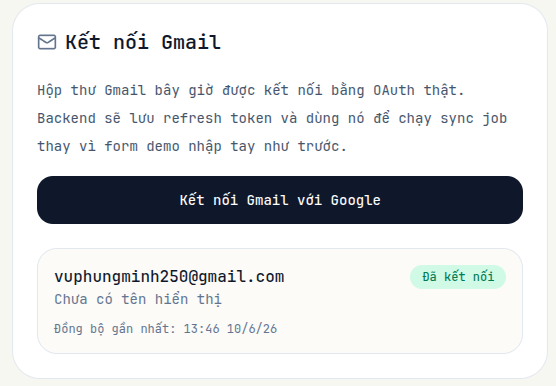
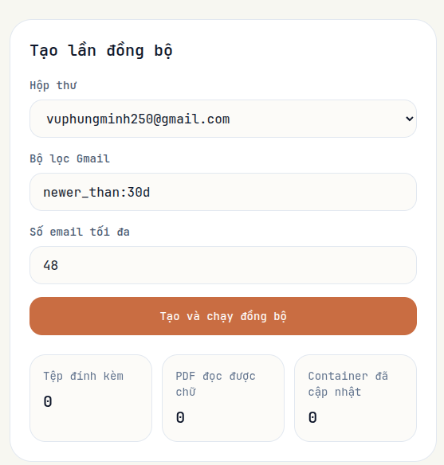
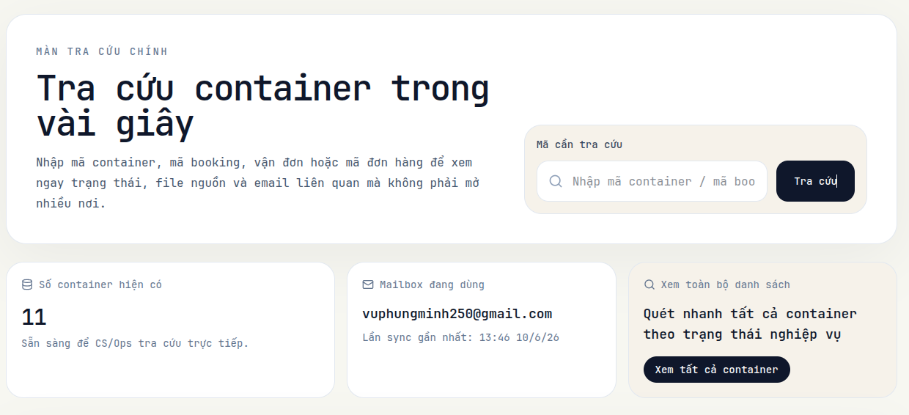
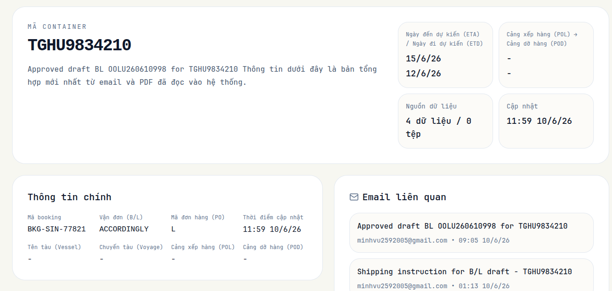
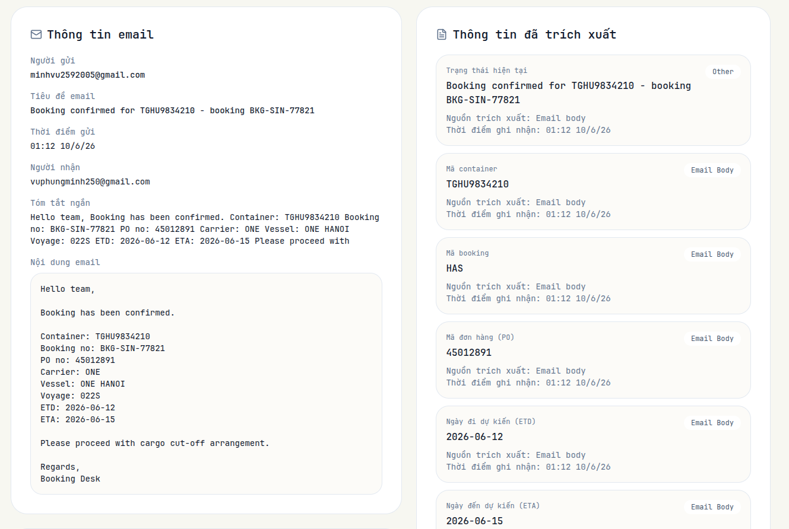
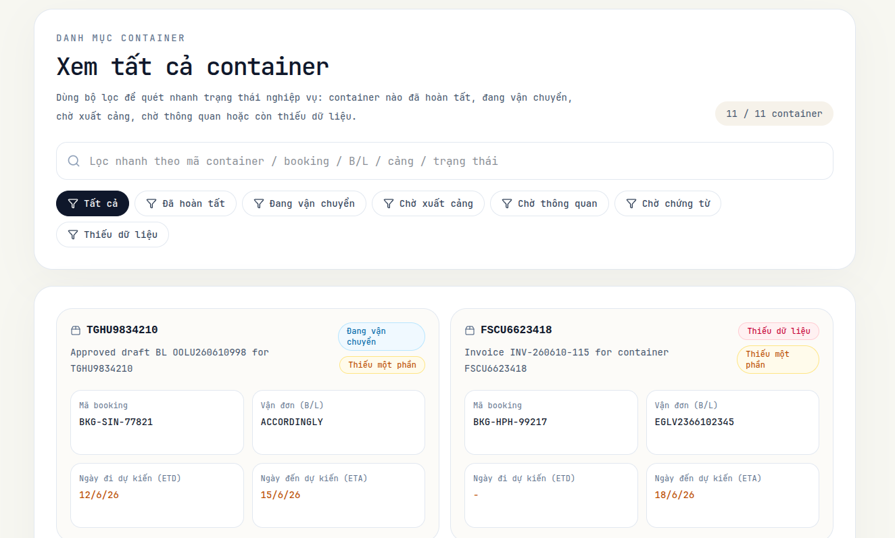

# Agentify Logistics

Agentify Logistics là prototype cho `Agentify Shipment Data Hub`, một lớp dữ liệu nằm phía trên các kênh vận hành logistics rời rạc như `Gmail`, `Excel`, `PDF`, ảnh chụp và các file đính kèm. Mục tiêu không phải thay thế `TMS`, `WMS`, `ERP` hay phần mềm forwarding, mà là gom dữ liệu của một shipment/container về một hồ sơ có thể tra cứu nhanh.

Prototype `v0.1` chứng minh một điều:

- Người dùng logistics có thể nhập `container`, `booking`, `B/L` hoặc `PO`.
- Hệ thống trả về các email liên quan, PDF liên quan, dữ liệu đã trích xuất, timeline và trạng thái tổng hợp.
- Mỗi thông tin đều giữ nguồn gốc rõ ràng để người dùng kiểm tra lại được.

## Prototype Này Làm Gì

Luồng dữ liệu cốt lõi hiện tại:

1. Kết nối `Gmail` bằng quyền chỉ đọc.
2. Đồng bộ email theo query và khoảng thời gian giới hạn.
3. Đọc body email và ingest attachment.
4. Trích text từ PDF (text-based) cho file nằm trong attachments.
5. Extract các field logistics như `container_no`, `booking_no`, `bl_no`, `pol`, `pod`, `etd`, `eta`, `vessel`, `voyage`.
6. Match dữ liệu vào shipment/container profile với confidence và provenance.
7. Cho phép tra cứu theo mã nghiệp vụ hoặc câu hỏi ngôn ngữ tự nhiên trên dữ liệu đã lưu.
8. Hiển thị kết quả kèm nguồn tham chiếu cụ thể, không tự bịa khi thiếu dữ liệu.

## Phạm Vi Hiện Tại

Trong prototype này, backend và frontend tập trung vào các phần sau:

- `Gmail API` với `gmail.readonly`
- Sync email có kiểm soát
- Ingest attachment và PDF text extraction
- Trích xuất field logistics có cấu trúc
- Shipment/container matching
- Shipment profile page
- Timeline và nguồn dữ liệu
- Search + tra cứu theo container/booking/B/L/PO


## Mô Hình Sản Phẩm

Agentify đóng vai trò là operational data hub:

- nguồn vào là email, PDF, ảnh, file đính kèm và dữ liệu đã sync
- đầu ra là một shipment/container profile dễ tra cứu
- mọi kết luận phải truy ngược được về email, attachment và timestamp

Nguyên tắc quan trọng:

- nếu không thấy dữ liệu, hệ thống phải nói `Not found in Agentify data`
- dữ liệu trích xuất phải giữ provenance
- match cần có confidence threshold và đường review cho case mơ hồ
- không được overwrite dữ liệu tin cậy một cách mù quáng

## Giao Diện Demo

Frontend hiện có 5 màn chính:

- `/` - `Tra cứu`
- `/setup` - `Thiết lập dữ liệu`
- `/containers` - `Danh mục container`
- `/containers/:containerNo` - `Chi tiết container`
- `/emails/:id` - `Chi tiết email nguồn`

### 1. Trang Tra Cứu

Đây là màn demo chính cho CS/Ops. Người dùng nhập mã `container`, `booking`, `B/L` hoặc `PO` vào ô tra cứu để xem danh sách kết quả hoặc đi thẳng sang chi tiết nếu chỉ có một match rõ ràng.

Màn này hiển thị:

- số container hiện có
- mailbox đang kết nối
- đường dẫn sang toàn bộ danh mục container
- danh sách container gần đây hoặc kết quả tra cứu

Đây là màn phù hợp nhất để demo giá trị cốt lõi của prototype: tìm một mã và mở ra ngay dữ liệu liên quan.

### 2. Trang Thiết Lập Dữ Liệu

Đây là màn kỹ thuật để chuẩn bị dữ liệu demo và kiểm tra trạng thái backend.

Người dùng có thể:

- kết nối Gmail qua OAuth
- chọn hộp thư
- tạo sync job
- chạy sync job
- xem email đã được ingest
- xem số attachment, số PDF đã extract, số container đã upsert

Màn này nên được dùng trước khi demo nếu cần nạp dữ liệu mới hoặc kiểm tra pipeline.

### 3. Danh Mục Container

Trang này cho phép quét nhanh toàn bộ container đã có trong hệ thống.

Người dùng có thể:

- tìm theo mã container, booking, B/L, PO, cảng hoặc trạng thái
- lọc theo trạng thái nghiệp vụ
- xem mức độ đầy đủ của dữ liệu
- mở chi tiết từng container

Màn này hữu ích khi người dùng muốn rà soát nhanh nhiều shipment thay vì tra một mã duy nhất.

### 4. Chi Tiết Container

Trang chi tiết là nơi thể hiện rõ nhất giá trị của Agentify.

Nó hiển thị:

- container number
- status text tổng hợp
- `ETA` / `ETD`
- `POL` / `POD`
- booking, B/L, PO, vessel, voyage
- số lượng source data và attachment
- danh sách email liên quan
- danh sách attachment liên quan
- provenance của từng field đã trích xuất

Từ đây người dùng có thể đi ngược về email nguồn hoặc mở trực tiếp PDF.

### 5. Chi Tiết Email Nguồn

Màn này dùng để kiểm tra bản gốc của dữ liệu.

Người dùng có thể:

- xem người gửi, tiêu đề, thời điểm gửi, người nhận
- đọc body email
- xem attachment
- mở preview PDF ngay trong giao diện
- xem các extracted facts được ghi nhận từ email đó
- nhảy sang container liên kết nếu có

Màn này quan trọng khi cần audit hoặc xác minh một field cụ thể đến từ đâu.

## Luồng Demo 

Luồng demo nên đi theo thứ tự sau:

1. Mở `/setup` và kết nối Gmail.

2. Tạo sync job với query giới hạn, ví dụ `newer_than:30d`.

3. Chạy job để ingest email và PDF.
4. Quay lại `/` để xem số container và mailbox đã có dữ liệu.

5. Tra cứu một mã container hoặc booking ở ô search chính.
6. Mở `Chi tiết container` để show shipment profile, facts, email liên quan và attachment liên quan.

7. Mở một `Email nguồn` để chứng minh provenance và PDF preview.

8. Nếu cần quét nhiều shipment, chuyển sang `/containers` và dùng bộ lọc trạng thái.


Luồng này thể hiện rõ thông điệp của prototype:

- dữ liệu đi vào từ Gmail
- dữ liệu được trích xuất và nối lại theo shipment
- người dùng tra cứu bằng mã nghiệp vụ quen thuộc
- mọi kết luận đều có nguồn để kiểm tra

## Cách Chạy

### Backend

1. Vào thư mục backend và cài dependency:

```bash
cd backend
uv sync
```

2. Tạo file cấu hình ở `backend/.env` và `backend/app-config.yaml`.

- `backend/.env` chứa các biến môi trường runtime, ví dụ `DATABASE_URL`, `INTERNAL_API_KEY`, `GMAIL_*`, `GEMINI_*`.
- `backend/app-config.yaml` là file cấu hình mà backend đọc trực tiếp lúc khởi động. Bạn có thể dùng `backend/app-config-template.yaml` làm mẫu.

3. Chạy PostgreSQL bằng Docker:

```bash
docker compose -f compose_db.yaml up -d postgres
```

4. Khởi tạo lại schema hiện tại từ model:

```bash
./.venv/bin/python scripts/reset_database.py
```

5. Chạy backend bằng Docker:

```bash
docker compose up -d --build
```

### Frontend

1. Vào thư mục frontend và cài dependency:

```bash
cd ../frontend
npm install
```

2. Chạy frontend:

```bash
npm run dev
```

Frontend và backend đều đã có sẵn trong repo. Điểm quan trọng là DB không tự reset khi app khởi động; nếu cần recreate schema hiện tại, chạy script riêng ở backend.

Nếu bạn cần, tôi có thể bổ sung thêm:

- phần `Quick Start` có lệnh chạy cụ thể
- sơ đồ kiến trúc ngắn gọn
- một checklist demo theo từng bước nói trên
