# Agentify Prototype v0.1 Database Design

> **Scope:** database này chỉ phục vụ prototype hẹp hiện tại:
> `Gmail read-only -> sync email -> parse email/PDF text -> extract field -> lưu PostgreSQL -> tra cứu theo container`.

> **Convention:** phần implement thực tế nên follow structure của repo mẫu `~/Documents/a-star/hackathon-aggregator/search-engine`, đặc biệt ở `config/`, `db/database.py`, `db/models.py`, `alembic/`, và cách dùng `.env` + `app-config.yaml`.

---

## 1. Mục tiêu thiết kế

Database cần giải quyết 4 việc:

1. lưu kết nối Gmail và lịch sử sync
2. lưu raw email và raw attachment để audit/debug
3. lưu dữ liệu đã extract theo `container`
4. giữ provenance ở mức field để UI có thể trả lời:
   - field này lấy từ email nào
   - field này lấy từ PDF nào
   - giá trị mới nhất là gì

Prototype này không cố mô hình hóa domain logistics đầy đủ.  
Nó chỉ cần một read model đủ tốt để user tra cứu nhanh theo `container_no`.

---

## 2. Mô hình tổng thể

Database có 2 lớp chính:

### Raw layer

- `gmail_connections`
- `sync_jobs`
- `emails`
- `attachments`

Lớp này giữ dữ liệu gốc lấy từ Gmail.

### Read / aggregation layer

- `containers`
- `container_facts`

Lớp này phục vụ UI và search theo container.

---

## 3. Danh sách bảng

### 3.1 `gmail_connections`

Mục đích:

- lưu một kết nối Gmail read-only
- biết mailbox nào đang sync
- biết sync status hiện tại

Các cột:

| Column | Type | Null | Ghi chú |
|---|---|---|---|
| `id` | `UUID` | No | PK |
| `workspace_id` | `UUID` | No | để tách dữ liệu theo workspace |
| `gmail_email` | `TEXT` | No | địa chỉ Gmail đã connect |
| `refresh_token_encrypted` | `TEXT` | No | token đã mã hóa |
| `scopes` | `TEXT[]` | No | mặc định chỉ `gmail.readonly` |
| `sync_status` | `TEXT` | No | `idle`, `running`, `error` |
| `last_synced_at` | `TIMESTAMPTZ` | Yes | lần sync gần nhất |
| `created_at` | `TIMESTAMPTZ` | No | default `now()` |
| `updated_at` | `TIMESTAMPTZ` | No | default `now()` |

Index:

- `(workspace_id)`

---

### 3.2 `sync_jobs`

Mục đích:

- theo dõi từng lần sync
- trả số liệu cho màn sync dashboard

Các cột:

| Column | Type | Null | Ghi chú |
|---|---|---|---|
| `id` | `UUID` | No | PK |
| `workspace_id` | `UUID` | No | scope dữ liệu |
| `gmail_connection_id` | `UUID` | No | FK -> `gmail_connections.id` |
| `status` | `TEXT` | No | `queued`, `running`, `completed`, `failed` |
| `gmail_query` | `TEXT` | Yes | query dùng khi sync |
| `started_at` | `TIMESTAMPTZ` | Yes | lúc bắt đầu |
| `finished_at` | `TIMESTAMPTZ` | Yes | lúc kết thúc |
| `emails_fetched_count` | `INTEGER` | No | số email lấy được |
| `attachments_found_count` | `INTEGER` | No | số attachment tìm thấy |
| `pdf_text_extracted_count` | `INTEGER` | No | số PDF parse được text |
| `containers_upserted_count` | `INTEGER` | No | số container tạo/cập nhật |
| `error_message` | `TEXT` | Yes | lỗi nếu fail |
| `created_at` | `TIMESTAMPTZ` | No | default `now()` |

Index:

- `(gmail_connection_id, created_at DESC)`

---

### 3.3 `emails`

Mục đích:

- lưu raw email metadata và body
- đảm bảo có thể trace ngược từ UI về email gốc

Các cột:

| Column | Type | Null | Ghi chú |
|---|---|---|---|
| `id` | `UUID` | No | PK |
| `workspace_id` | `UUID` | No | scope dữ liệu |
| `gmail_connection_id` | `UUID` | No | FK -> `gmail_connections.id` |
| `sync_job_id` | `UUID` | Yes | FK -> `sync_jobs.id` |
| `gmail_message_id` | `TEXT` | No | id message từ Gmail |
| `gmail_thread_id` | `TEXT` | Yes | id thread từ Gmail |
| `subject` | `TEXT` | Yes | subject |
| `sender` | `TEXT` | Yes | from |
| `recipients_to` | `TEXT[]` | No | danh sách to |
| `recipients_cc` | `TEXT[]` | No | danh sách cc |
| `sent_at` | `TIMESTAMPTZ` | Yes | thời gian gửi |
| `snippet` | `TEXT` | Yes | snippet Gmail |
| `body_text` | `TEXT` | Yes | plain text body |
| `body_html` | `TEXT` | Yes | html body |
| `has_pdf_attachments` | `BOOLEAN` | No | có PDF hay không |
| `processing_status` | `TEXT` | No | `pending`, `processed`, `failed` |
| `created_at` | `TIMESTAMPTZ` | No | default `now()` |
| `updated_at` | `TIMESTAMPTZ` | No | default `now()` |

Unique:

- `(gmail_connection_id, gmail_message_id)`

Index:

- `(workspace_id, sent_at DESC)`
- `(processing_status)`

---

### 3.4 `attachments`

Mục đích:

- lưu PDF attachment liên quan một email
- lưu text extraction result

Các cột:

| Column | Type | Null | Ghi chú |
|---|---|---|---|
| `id` | `UUID` | No | PK |
| `workspace_id` | `UUID` | No | scope dữ liệu |
| `email_id` | `UUID` | No | FK -> `emails.id` |
| `gmail_attachment_id` | `TEXT` | Yes | id attachment từ Gmail |
| `filename` | `TEXT` | No | tên file |
| `mime_type` | `TEXT` | No | loại file |
| `size_bytes` | `BIGINT` | Yes | dung lượng |
| `storage_url` | `TEXT` | Yes | path/object storage nếu có |
| `is_pdf` | `BOOLEAN` | No | có phải PDF |
| `is_text_pdf` | `BOOLEAN` | Yes | PDF có text layer hay không |
| `text_extract_status` | `TEXT` | No | `pending`, `extracted`, `unsupported`, `failed` |
| `extracted_text` | `TEXT` | Yes | nội dung text parse ra |
| `extraction_error` | `TEXT` | Yes | lỗi parse |
| `created_at` | `TIMESTAMPTZ` | No | default `now()` |
| `updated_at` | `TIMESTAMPTZ` | No | default `now()` |

Index:

- `(email_id)`
- `(text_extract_status)`

---

### 3.5 `containers`

Mục đích:

- read model trung tâm cho UI
- mỗi record đại diện cho một `container_no`
- giữ `latest known values`

Các cột:

| Column | Type | Null | Ghi chú |
|---|---|---|---|
| `id` | `UUID` | No | PK |
| `workspace_id` | `UUID` | No | scope dữ liệu |
| `container_no` | `TEXT` | No | business key |
| `booking_no` | `TEXT` | Yes | latest booking |
| `bl_no` | `TEXT` | Yes | latest B/L |
| `po_no` | `TEXT` | Yes | latest PO |
| `vessel` | `TEXT` | Yes | latest vessel |
| `voyage` | `TEXT` | Yes | latest voyage |
| `pol` | `TEXT` | Yes | latest port of loading |
| `pod` | `TEXT` | Yes | latest port of discharge |
| `etd` | `DATE` | Yes | latest ETD |
| `eta` | `DATE` | Yes | latest ETA |
| `status_text` | `TEXT` | Yes | latest status |
| `first_seen_at` | `TIMESTAMPTZ` | Yes | source cũ nhất |
| `last_seen_at` | `TIMESTAMPTZ` | Yes | source mới nhất |
| `source_count` | `INTEGER` | No | số fact/source liên quan |
| `attachment_count` | `INTEGER` | No | số attachment liên quan |
| `created_at` | `TIMESTAMPTZ` | No | default `now()` |
| `updated_at` | `TIMESTAMPTZ` | No | default `now()` |

Unique:

- `(workspace_id, container_no)`

Index:

- `(workspace_id, container_no)`
- `(workspace_id, updated_at DESC)`

---

### 3.6 `container_facts`

Mục đích:

- bảng quan trọng nhất để giữ provenance
- mỗi field extract được ghi thành một fact riêng
- một container có thể có nhiều fact cho cùng một field

Ví dụ:

- `eta = 2026-06-12` từ email ngày 08/06
- `eta = 2026-06-14` từ email ngày 09/06

`containers.eta` sẽ giữ giá trị mới nhất, còn `container_facts` giữ toàn bộ lịch sử.

Các cột:

| Column | Type | Null | Ghi chú |
|---|---|---|---|
| `id` | `UUID` | No | PK |
| `workspace_id` | `UUID` | No | scope dữ liệu |
| `container_id` | `UUID` | No | FK -> `containers.id` |
| `email_id` | `UUID` | Yes | FK -> `emails.id` |
| `attachment_id` | `UUID` | Yes | FK -> `attachments.id` |
| `document_type` | `TEXT` | Yes | `arrival_notice`, `bl_draft`, ... |
| `field_name` | `TEXT` | No | `eta`, `booking_no`, `bl_no`, ... |
| `field_value` | `TEXT` | Yes | raw value |
| `normalized_value` | `TEXT` | Yes | normalized value |
| `source_type` | `TEXT` | No | `email_subject`, `email_body`, `pdf_text` |
| `source_label` | `TEXT` | Yes | đoạn text hoặc label nguồn |
| `source_sent_at` | `TIMESTAMPTZ` | Yes | thời gian email nguồn |
| `created_at` | `TIMESTAMPTZ` | No | default `now()` |

Index:

- `(container_id)`
- `(container_id, field_name)`
- `(source_sent_at DESC)`

---

## 4. Quan hệ giữa các bảng

### Quan hệ chính

- một `gmail_connection` có nhiều `sync_jobs`
- một `gmail_connection` có nhiều `emails`
- một `sync_job` có thể gắn với nhiều `emails`
- một `email` có nhiều `attachments`
- một `container` có nhiều `container_facts`
- một `email` có thể đóng góp fact cho nhiều `containers`
- một `attachment` có thể đóng góp fact cho nhiều `containers`

### Lý do không cần bảng join email-container riêng

Prototype này có thể suy ra liên kết đó từ `container_facts`.

Ví dụ:

- muốn biết email nào liên quan container `MSCU1234567`
- chỉ cần query `container_facts` theo `container_id`
- lấy distinct `email_id`

Như vậy ít bảng hơn mà vẫn đủ cho UI.

---

## 5. ERD

```mermaid
erDiagram
    GMAIL_CONNECTIONS ||--o{ SYNC_JOBS : creates
    GMAIL_CONNECTIONS ||--o{ EMAILS : syncs
    SYNC_JOBS ||--o{ EMAILS : batches
    EMAILS ||--o{ ATTACHMENTS : has
    CONTAINERS ||--o{ CONTAINER_FACTS : aggregates
    EMAILS ||--o{ CONTAINER_FACTS : sources
    ATTACHMENTS ||--o{ CONTAINER_FACTS : sources

    GMAIL_CONNECTIONS {
        uuid id PK
        uuid workspace_id
        text gmail_email
        text refresh_token_encrypted
        text_array scopes
        text sync_status
        timestamptz last_synced_at
        timestamptz created_at
        timestamptz updated_at
    }

    SYNC_JOBS {
        uuid id PK
        uuid workspace_id
        uuid gmail_connection_id FK
        text status
        text gmail_query
        timestamptz started_at
        timestamptz finished_at
        int emails_fetched_count
        int attachments_found_count
        int pdf_text_extracted_count
        int containers_upserted_count
        text error_message
        timestamptz created_at
    }

    EMAILS {
        uuid id PK
        uuid workspace_id
        uuid gmail_connection_id FK
        uuid sync_job_id FK
        text gmail_message_id
        text gmail_thread_id
        text subject
        text sender
        text_array recipients_to
        text_array recipients_cc
        timestamptz sent_at
        text snippet
        text body_text
        text body_html
        boolean has_pdf_attachments
        text processing_status
        timestamptz created_at
        timestamptz updated_at
    }

    ATTACHMENTS {
        uuid id PK
        uuid workspace_id
        uuid email_id FK
        text gmail_attachment_id
        text filename
        text mime_type
        bigint size_bytes
        text storage_url
        boolean is_pdf
        boolean is_text_pdf
        text text_extract_status
        text extracted_text
        text extraction_error
        timestamptz created_at
        timestamptz updated_at
    }

    CONTAINERS {
        uuid id PK
        uuid workspace_id
        text container_no
        text booking_no
        text bl_no
        text po_no
        text vessel
        text voyage
        text pol
        text pod
        date etd
        date eta
        text status_text
        timestamptz first_seen_at
        timestamptz last_seen_at
        int source_count
        int attachment_count
        timestamptz created_at
        timestamptz updated_at
    }

    CONTAINER_FACTS {
        uuid id PK
        uuid workspace_id
        uuid container_id FK
        uuid email_id FK
        uuid attachment_id FK
        text document_type
        text field_name
        text field_value
        text normalized_value
        text source_type
        text source_label
        timestamptz source_sent_at
        timestamptz created_at
    }
```

---

## 6. Luồng ghi dữ liệu

### Bước 1: Gmail sync

- tạo `sync_jobs`
- lưu `emails`
- lưu `attachments`

### Bước 2: PDF text extraction

- update `attachments.is_text_pdf`
- update `attachments.text_extract_status`
- lưu `attachments.extracted_text`

### Bước 3: Field extraction

- task 1-2 trả extraction payload
- nếu có `container_no`, backend tìm hoặc tạo `containers`
- ghi từng field thành `container_facts`

### Bước 4: Container aggregation

- update `containers.booking_no`, `bl_no`, `eta`, `etd`, ...
- rule ghi đè theo `source_sent_at` mới hơn
- update `first_seen_at`, `last_seen_at`, `source_count`, `attachment_count`

---

## 7. Quy tắc normalize

### `container_no`

- uppercase
- trim space
- không đoán nếu format mơ hồ

### `booking_no`, `bl_no`, `po_no`

- trim
- giữ nguyên case nếu chưa có quy chuẩn chắc chắn

### `eta`, `etd`

- parse về `DATE`
- raw text vẫn giữ trong `container_facts.field_value`
- normalized date lưu ở `container_facts.normalized_value`

### `status_text`

- giữ text ngắn, đọc được trên UI
- chưa cần chuẩn hóa thành enum trong v0.1

---

## 8. Query patterns chính

### Container list

Nguồn:

- `containers`

Sort thường dùng:

- `updated_at DESC`

Search:

- `container_no ILIKE :q%`

### Container detail

Nguồn:

- `containers`
- `container_facts`
- `emails`
- `attachments`

### Email detail

Nguồn:

- `emails`
- `attachments`
- `container_facts`

---

## 9. Các field business hỗ trợ trong v0.1

### Required để tạo container

- `container_no`

### High-value fields

- `booking_no`
- `bl_no`
- `po_no`
- `vessel`
- `voyage`
- `pol`
- `pod`
- `etd`
- `eta`
- `status_text`
- `document_type`

### Optional

- `shipper`
- `consignee`
- `seal_no`

Lưu ý:

- có thể extract optional fields và lưu vào `container_facts`
- nhưng chưa nhất thiết đưa hết lên `containers`

---

## 10. Các quyết định cố ý chưa làm

### Chưa có `shipments` table

Lý do:

- prototype hiện tra cứu theo `container`
- thêm shipment graph lúc này làm tăng độ phức tạp, chưa tăng value demo

### Chưa có `review_queue`

Lý do:

- prototype hiện không đi sâu vào ambiguous matching flow

### Chưa có `ocr_jobs`

Lý do:

- v0.1 không hỗ trợ OCR

### Chưa có `email_container_links`

Lý do:

- có thể suy ra từ `container_facts`

---

## 11. Migration order đề xuất

1. tạo `gmail_connections`
2. tạo `sync_jobs`
3. tạo `emails`
4. tạo `attachments`
5. tạo `containers`
6. tạo `container_facts`
7. thêm indexes

---

## 12. Checklist thực hiện

- [ ] Tạo `app-config.yaml` và `.env` theo convention repo mẫu
- [ ] Tạo `config/models.py` cho root config schema
- [ ] Tạo `config/__init__.py` để load YAML + env vars
- [ ] Tạo `config/settings.py` expose config singletons
- [ ] Tạo `config/database_config.py`
- [ ] Tạo `db/database.py` với async engine và `get_db()`
- [ ] Tạo `db/models.py` với 6 bảng ở trên
- [ ] Tạo migration Alembic đầu tiên
- [ ] Seed dữ liệu mẫu cho `emails`, `attachments`, `containers`, `container_facts`
- [ ] Kiểm tra query container list
- [ ] Kiểm tra query container detail
- [ ] Kiểm tra provenance từ `container_facts`

---

## 13. Kết luận

Thiết kế DB này cố ý tối giản nhưng vẫn giữ được 2 điểm quan trọng nhất của prototype:

1. tra cứu nhanh theo `container`
2. truy vết được mỗi field lấy từ email/PDF nào

Nếu prototype chạy tốt với schema này, bước sau mới nên cân nhắc mở rộng sang:

- `shipments`
- review queue
- OCR
- multi-source ingestion ngoài Gmail
